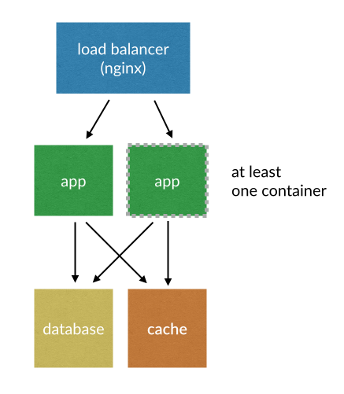

# Voting App

## Docker architecture overview



**Note**: configuration uses latest images so versions of software might be different after fresh setup.

### load balancer
nginx 1.9.9 is a used as a load balancer.

### app
Application is written in Rails 4.2.5. Container uses Passenger 5.0.22 on Ruby 2.2.3.

### cache
`cache` is used as a data volume for caching gems from `bundle install` command.

### database
Container is running PostgreSQL 9.4.5.

## Installation

Tested on Docker 1.9.1, docker-compose 1.5.2.

1. Install [Docker](https://www.docker.com/)
2. Clone repository `git clone https://github.com/szemek/voting-app.git`
3. Inside repository run `docker-compose up`
4. Open IP address where your docker machine is running. Port 80.

### Scaling up

```
docker-compose scale app=N
docker-compose up --force-recreate
```
